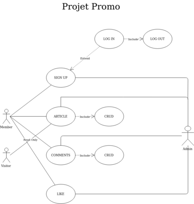

# CAHIER DES CHARGES

**Nom de l'entreprise :** Yes We Web, opérée par le Campus Vitamine T

**Nom du projet** : yesweweb.org - Site de la Promotion

**Personne à contacter dans l'entreprise** : Mathilde De Beaune

**Adresse** : 2 Boulevard Thomson 59810 Lesquin

**Email** : mathilde.debeaune@groupevitaminet.com

1.  Présentation du projet :
    1.  Les objectifs du site.
    2.  Les cibles.
    3.  Intervenants au projet.
2.  Graphisme et ergonomie :
    1.  La charte graphique.
    2.  Wireframe et Maquettage.
3.  Spécificités et livrables :
    1.  Contenu du site.
    2.  Contraintes techniques.

## 1. Présentation de l'entreprise

**Yes We Web**, c'est une formation courte et gratuite qui permet d'obtenir le titre professionnel Développeur Logiciel de Niveau III (équivalent Bac + 2) ! Cette formation est opérée par le **campus Vitaminte T** à Lesquin, co-financée par la **Fondation des Possibles** et la **Grande Ecole du Numérique**.

### Les objectifs du site

Le but de ce projet est de créer un blog communautaire de la promotion Yes We Web (actuel et à venir...), pouvoir avoir un lieu de partage entre apprenant où l'on puisse poster des articles, parler des technologies utilisés pendant la formation avec un système d'inscription et de connexion.

### Les cibles

**Cibles principales** :

Les apprenants (actuels ou alumnus).

**Cibles secondaires** :

Les visiteurs externes à la formation (patron, personnes intéressées par la formation, recruteurs, etc..).

### Intervenants au projet

-   **Samy Nasri** - _Chef de Projet_ : Il veille au bon déroulement du projet, il gère les tâches à effectuer (immédiates ou futures).
-   **Donovan Ringot** - _Tech Lead_ : Il prend en charge tout ce qui est choix techniques, façon de travailler, technologies utilisées.
-   **Antoine Gonçalves** - _Product Owner_ : Il est en lien direct avec le client, communicateur entre son équipe et le client.

## Graphisme et ergonomie

### La charte graphique

Un thème global bleu et vert aux couleurs de Yes We Web, bien organisé, classé par hashtag et couleurs.

ATTENTE CHARTE GRAPHIQUE..

Exemples de sites que le client aime : <https://scotch.io/>

### Wireframe et maquettage

Pour les wireframes :

Image Wireframe

Pour les maquettages :

Deux types de maquettages, type UML(Unified Modeling Language) :

-   UML Diagramme de Classes :

-   UML Diagramme Cas d'utilisation :

## Spécificités et livrables

### Contenu du site

Le site doit contenir un système de connexion et d'inscription pour les apprenants, où l'on puisse poser des articles pour la communauté en fonction des technologies dont on souhaite parler, on pourra également commenter les articles qui nous intéressent, mais également les liker. Pour trouver un article sur le site, un système d'hashtags/couleurs sera mis en place.

### Contraintes techniques

Serveur déjà fait en attente de production.

Au niveau de la maintenance du site, nous sommes dans l'attente d'une réponse pour voir comment cela va se passer.

Les technologies utilisées pour le site sont :

-   **NuxtJS**
-   **Vuetify**
-   **Axios**
-   **NodeJS**
-   **Postgres**
-   **Sequelize**
-   **Express**
